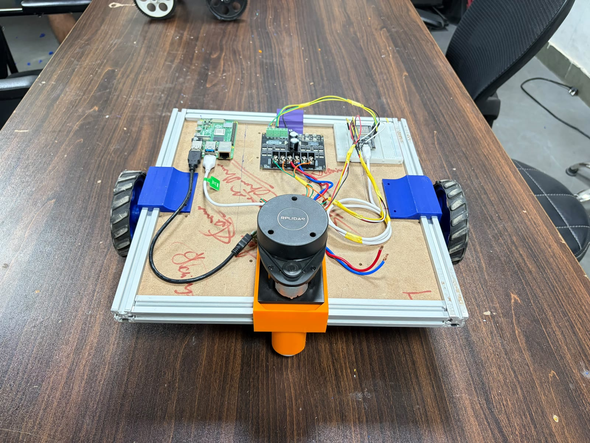

# Autonomous Mobile Robot (AMR)

Differential-drive autonomous mobile robot built on ROS 2 Humble with a Raspberry Pi and an ESP32 linked over
micro-ROS (Wi-Fi). It maps its surroundings with SLAM Toolbox using an RPLIDAR A1 and navigates autonomously with Nav2.

Built from scratch by the Robotics Society, IIT Jodhpur (core team 2026–27) as Inter-IIT preparation:
work started on 23 Sep 2026, the robot mapped with SLAM on 26 Sep and navigated autonomously on 28 Sep.



```
RPLIDAR A1 → Raspberry Pi (ROS 2: SLAM Toolbox, Nav2, odometry) ⇄ micro-ROS over Wi-Fi ⇄ ESP32 (wheel PID + encoders) → Cytron driver → motors
```

## Repository structure

| Folder | What's in it | Start here if you want to... |
|---|---|---|
| [`final-product/`](final-product/README.md) | The deployed robot: ROS 2 workspace, ESP32 firmware, bringup script, maps, architecture diagrams, hardware and calibration notes, demo videos, CAD | run the robot or continue developing it |
| [`learning/`](learning/README.md) | The iteration phase: every team member's original work folders, the approaches that were tried (software and hardware) and why the final ones were chosen, test videos | understand how and why the design ended up this way |
| [`resource-guide/`](resource-guide/README.md) | Curated learning resources: ROS 2, TF, differential-drive kinematics, PID, micro-ROS, SLAM, Nav2 | learn the background before touching the code |

## Quick start (on the robot's Raspberry Pi)

```bash
git clone <repo-url> ~/amr-repo
ln -s ~/amr-repo/final-product ~/amr
cd ~/amr
scripts/install_deps.sh && scripts/build.sh
./amr_bringup.sh            # robot + Nav2 on the saved map
```

Full instructions, including flashing the ESP32: [final-product/README.md](final-product/README.md).

## Team

The work was split into verticals (details and timeline: [learning/project-log.md](learning/project-log.md)).

| Vertical | Worked on | Members |
|---|---|---|
| R1 SLAM | RPLIDAR driver, SLAM Toolbox | TODO |
| R2 Controller & HW interface | differential drive controller (`amr_diff_drive`) | TODO |
| R3 micro-ROS communication | ESP32 ⇄ Pi link, topic formats | TODO |
| R4 Nav2 | navigation configuration | TODO |
| E1 Motor control | ESP32 wheel PID and PWM | TODO |
| E2 Encoder / decoder | encoder decoding and calibration | TODO |
| HW / CAD | chassis, 3D-printed mounts | TODO |
