# Architecture

From the whole system down to individual functions and wires. The diagrams are Mermaid and render on GitHub.

1. [System level](#1-system-level)
2. [ROS 2 graph on the Raspberry Pi](#2-ros-2-graph-on-the-raspberry-pi)
3. [TF tree](#3-tf-tree)
4. [Startup sequence (`amr_bringup.sh`)](#4-startup-sequence-amr_bringupsh)
5. [Module level](#5-module-level): `amr_diff_drive`, Nav2, ESP32 firmware
6. [Function level](#6-function-level): kinematics, wheel control law, encoder timestamps
7. [Circuit level](#7-circuit-level): ESP32 wiring

---

## 1. System level

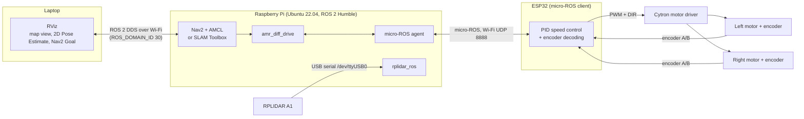

| Subsystem | Runs on | Job |
|---|---|---|
| Navigation / mapping | Pi | Builds the map (SLAM Toolbox) or localizes on it (AMCL) and plans + follows paths (Nav2), outputs `/cmd_vel` |
| Base controller | Pi (`amr_diff_drive`) | `/cmd_vel` → wheel speed setpoints; encoder data → odometry + `odom → base_link` |
| Bridge | Pi (micro-ROS agent) | Connects the ESP32 to the ROS 2 graph |
| Low-level control | ESP32 | Closes the wheel speed loops at 50 Hz, reads the encoders, publishes wheel state |
| Sensing | RPLIDAR A1 | 360° laser scans (`/scan`) |

---

## 2. ROS 2 graph on the Raspberry Pi

**Nav mode** (`./amr_bringup.sh`, the default):

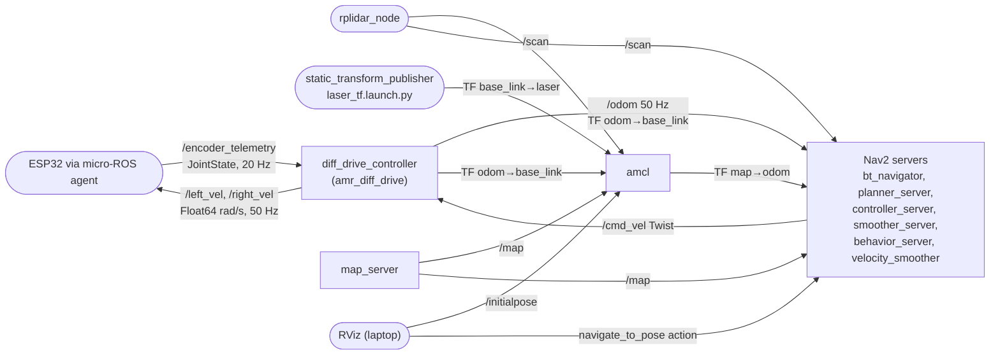

All Nav2 nodes, `map_server` and `amcl` run in one process (`use_composition:=True`) to save RAM on the Pi.

**Slam mode** (`./amr_bringup.sh slam`): `map_server`, `amcl` and the Nav2 servers are replaced by
`slam_toolbox` (async), which consumes `/scan` + `odom → base_link` and publishes `/map` + `map → odom`.
`/cmd_vel` comes from teleop (`amr_teleop` or `teleop_twist_keyboard`).

---

## 3. TF tree

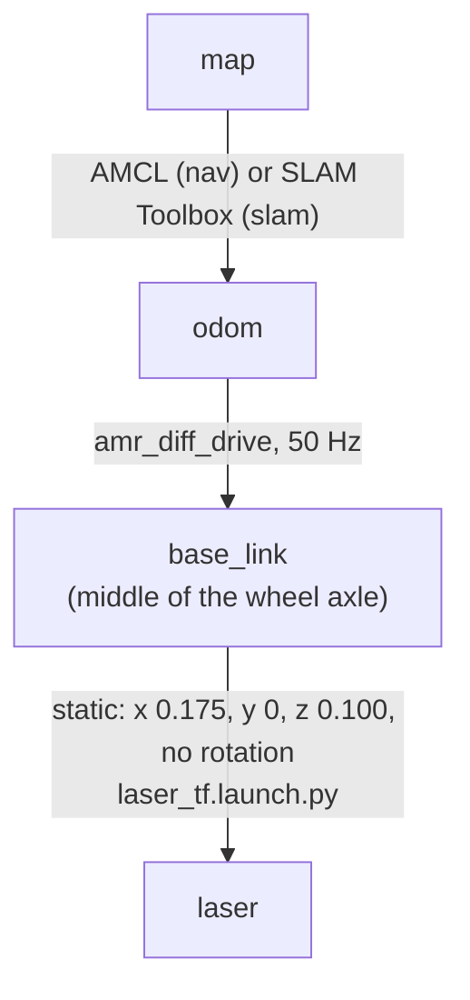

---

## 4. Startup sequence (`amr_bringup.sh`)

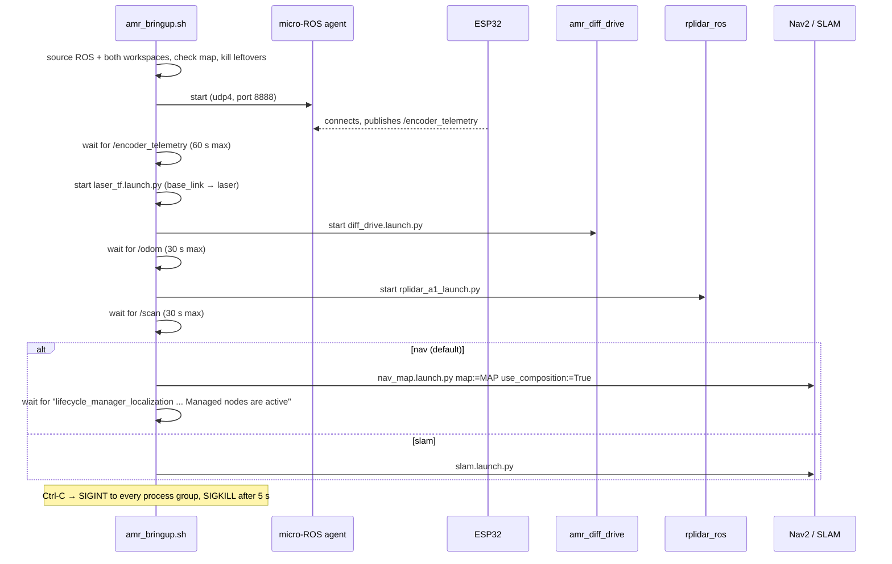

Each program runs in its own process group and logs to `~/amr_logs/<name>.log`.

---

## 5. Module level

### 5.1 `amr_diff_drive` (Python node `diff_drive_controller`)

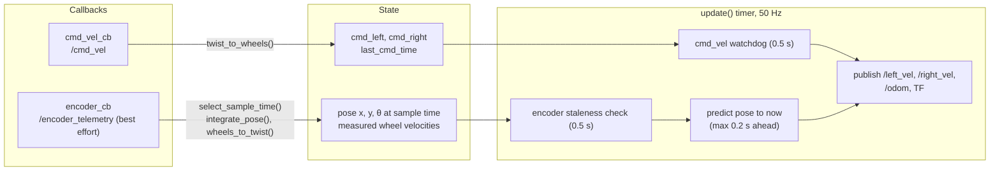

Pure math lives in `amr_diff_drive/kinematics.py` (no ROS, unit tested); the node only handles ROS I/O and state.

### 5.2 Nav2 pipeline (`amr_navigation/config/nav2_params.yaml`)

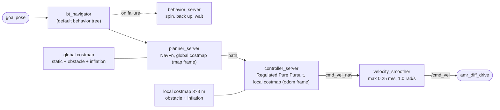

`smoother_server` (simple smoother) is also started, but Humble's default behavior tree doesn't call it;
`waypoint_follower` handles multi-goal missions.

### 5.3 ESP32 firmware (`firmware/esp32/amr_esp32/amr_esp32.ino`)

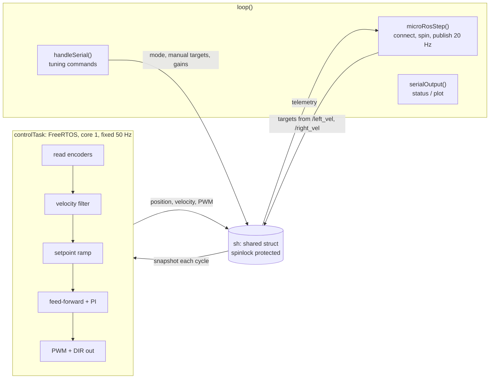

micro-ROS connection state machine (motors are stopped whenever the agent isn't connected):

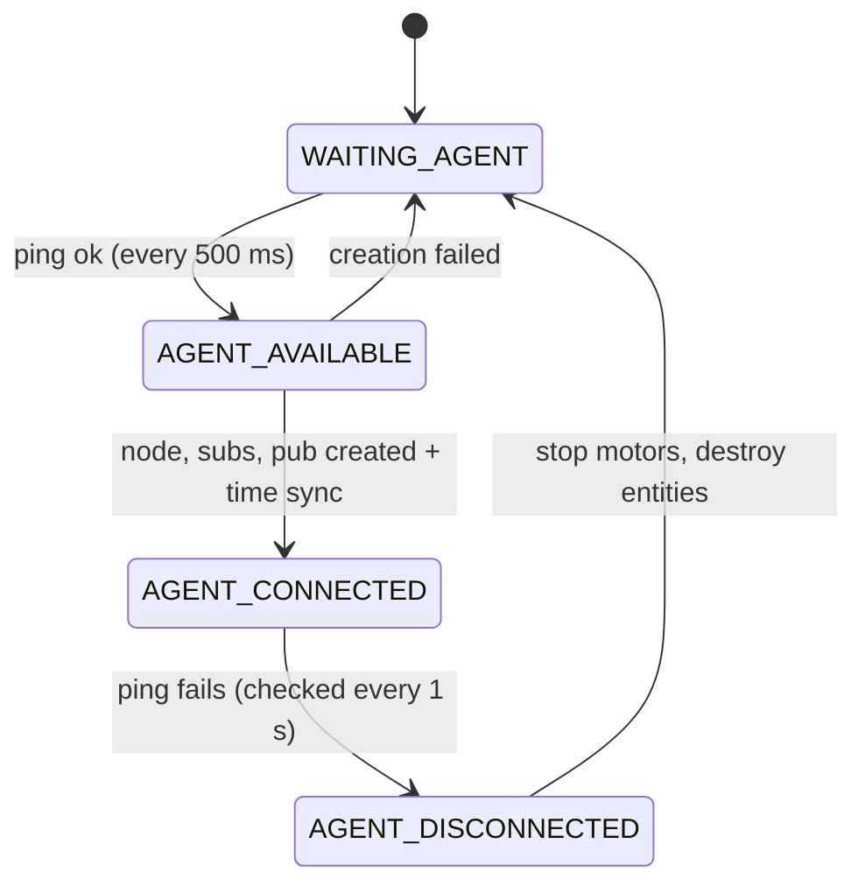

---

## 6. Function level

### 6.1 Differential-drive kinematics (`kinematics.py`)

r = wheel radius (0.056 m), L = wheel separation (0.39 m), REP-103 frame (x forward, y left, yaw counter-clockwise).

| Function | Math |
|---|---|
| `twist_to_wheels(v, ω)` | ω_L = (v − ω·L/2) / r, ω_R = (v + ω·L/2) / r; if max(\|ω_L\|, \|ω_R\|) > 17 rad/s, both are scaled by the same factor (keeps the path curvature) |
| `wheels_to_twist(ω_L, ω_R)` | v = r(ω_R + ω_L)/2, ω = r(ω_R − ω_L)/L |
| `integrate_pose(Δφ_L, Δφ_R)` | Δs = r(Δφ_R + Δφ_L)/2, Δθ = r(Δφ_R − Δφ_L)/L; exact arc: x += (Δs/Δθ)(sin(θ+Δθ) − sin θ), y −= (Δs/Δθ)(cos(θ+Δθ) − cos θ); midpoint formula when \|Δθ\| < 1e-6 |
| `predict_pose(age)` | `integrate_pose` with Δφ = ω_measured · age, only if 0 < age ≤ 0.2 s; never written back into the stored pose |

### 6.2 Encoder timestamp acceptance (`select_sample_time`)

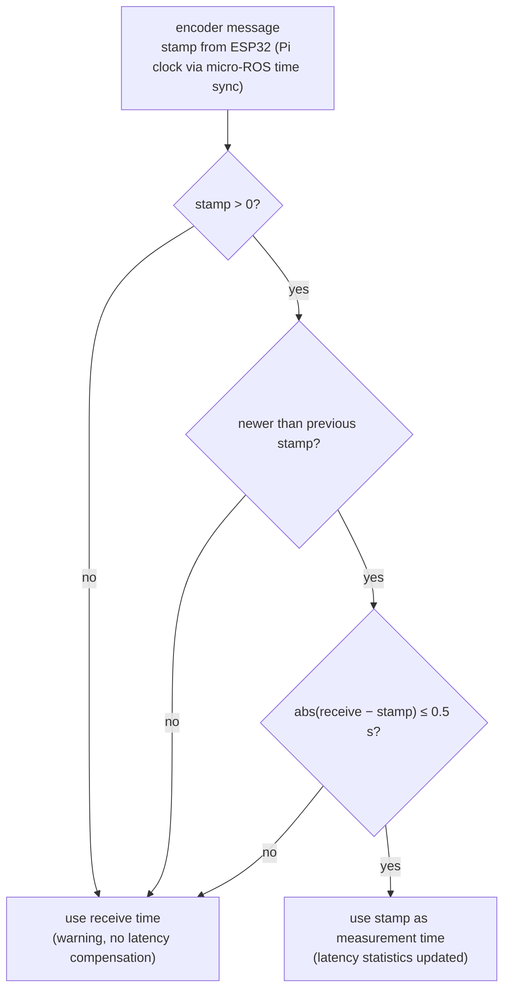

### 6.3 Per-wheel speed control (ESP32 `updateWheel`, every 20 ms)

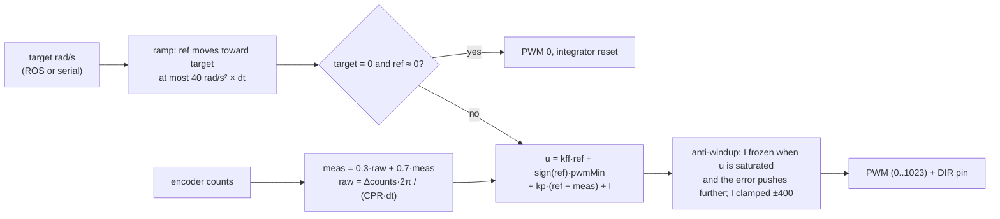

Gains, CPR and invert flags per wheel: [firmware README §3](../firmware/esp32/README.md#3-configuration-top-of-the-sketch).

---

## 7. Circuit level

Signal wiring as defined in the firmware pin map:

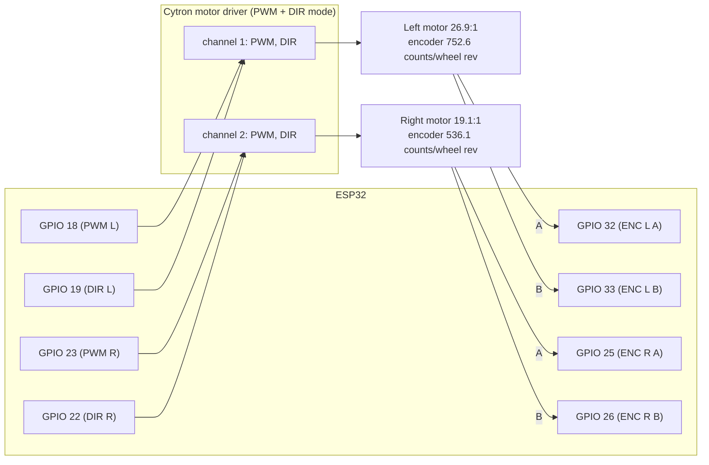

- PWM: 20 kHz, 10-bit. Encoder inputs use the ESP32's internal pull-ups and a glitch filter.
- The Cytron channel numbering above is illustrative; check which driver channel each motor is on.
- **TODO (team): power wiring.** Battery type/voltage, fuse/switch, the supply for the motor driver, the 5 V supply
  for the Raspberry Pi, how the ESP32 is powered, and the common ground. Add a wiring photo or schematic
  here or in [hardware.md](hardware.md).
