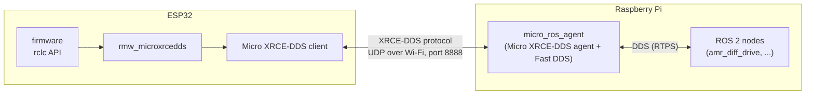

# micro-ROS communication (ESP32 ⇄ Raspberry Pi)

How the ESP32 becomes part of the ROS 2 graph: transport, the agent, entities, QoS, message memory,
time synchronization, reconnection, and how to debug it.

Code: [`firmware/esp32/amr_esp32/amr_esp32.ino`](../../firmware/esp32/amr_esp32/amr_esp32.ino) (micro-ROS layer),
[`microros_ws/`](../../microros_ws/) (agent), [`amr_bringup.sh`](../../amr_bringup.sh) (starts the agent),
[`scripts/build.sh`](../../scripts/build.sh) (builds it).

---

## 1. Why micro-ROS and how it works

A microcontroller can't run a full DDS stack. micro-ROS splits the work:



- The **client** (on the ESP32) sends small XRCE requests: "create a participant", "create a topic", "write this sample".
- The **agent** (on the Pi) creates the real DDS entities *on the ESP32's behalf* and forwards data both ways.
  To every other ROS 2 node, the ESP32's publishers and subscribers look like normal ROS 2 endpoints.
- If the agent isn't running, the ESP32 has no connection to ROS at all.

## 2. The agent (Pi side)

| Item | Value |
|---|---|
| Package | `micro_ros_agent` 3.0.6 (in `microros_ws/src/uros/micro-ROS-Agent/`), plus `micro_ros_msgs` |
| Built by | `scripts/build.sh agent`: `colcon build --packages-select micro_ros_setup`, then `ros2 run micro_ros_setup build_agent.sh`, which runs `colcon build --packages-up-to micro_ros_agent --cmake-args -DUAGENT_BUILD_EXECUTABLE=OFF -DUAGENT_P2P_PROFILE=OFF` |
| Superbuild | The agent's CMake downloads and builds eProsima **Micro-XRCE-DDS-Agent v2.4.2** (needs internet on the first build) |
| Started by | `amr_bringup.sh` step 1: `ros2 run micro_ros_agent micro_ros_agent udp4 --port 8888`, log `~/amr_logs/agent.log` |
| Transport | UDP over IPv4, listening on port 8888 on all interfaces |
| Readiness check | the bringup waits up to 60 s for a message on `/encoder_telemetry` |

Other agent options (not used here): `-v6` (verbose log, shows every message), `serial --dev /dev/ttyUSB0 -b 115200` for a wired link.

The agent keeps one "graph manager" per DDS domain: **the domain of the ESP32's entities is chosen by the ESP32**,
not by the agent's `ROS_DOMAIN_ID` (see §8).

## 3. Transport setup (ESP32 side)

```cpp
#define SSID_NAME       "YOUR_WIFI_SSID"        // CHANGE BEFORE COMPILING
#define SSID_PASSWORD   "YOUR_WIFI_PASSWORD"    // CHANGE BEFORE COMPILING
#define AGENT_IP        "192.168.0.100"         // CHANGE: the Pi's current IP (hostname -I)
#define AGENT_PORT      8888
```

In `setup()`:
1. `WiFi.begin(SSID_NAME, SSID_PASSWORD)` and wait until connected (prints the ESP32's IP).
2. `set_microros_wifi_transports(SSID, PASSWORD, AGENT_IP, AGENT_PORT)`: registers micro_ros_arduino's UDP
   transport so every XRCE packet goes to `AGENT_IP:8888`.
3. `WiFi.setSleep(false)`: disables Wi-Fi modem sleep. With sleep on, the radio naps between beacons and UDP latency
   jumps to tens or hundreds of ms.
4. `initTelemetryMsg()`, then `agentState = WAITING_AGENT`. The micro-ROS entities are created later by the state machine (§5).

The control task is started **before** Wi-Fi, so the motors are held at zero while the network comes up.

## 4. Entities, topics and QoS

| Entity | Name | Type | QoS | Created with |
|---|---|---|---|---|
| Node | `esp32_wifi_wheel_node` (no namespace) | | | `rclc_node_init_default` |
| Subscription | `left_vel` → `/left_vel` | `std_msgs/msg/Float64` | reliable, keep last (default) | `rclc_subscription_init_default` |
| Subscription | `right_vel` → `/right_vel` | `std_msgs/msg/Float64` | reliable, keep last (default) | `rclc_subscription_init_default` |
| Publisher | `encoder_telemetry` → `/encoder_telemetry` | `sensor_msgs/msg/JointState` | **best effort** | `rclc_publisher_init_best_effort` |
| Executor | 2 handles (one per subscription), `ON_NEW_DATA` | | | `rclc_executor_init(..., 2, ...)` |

QoS compatibility with the Pi side:
- `amr_diff_drive` publishes `/left_vel` and `/right_vel` **reliable** (depth 10) → matches the reliable subscriptions.
- `amr_diff_drive` subscribes to `/encoder_telemetry` with `qos_profile_sensor_data` (**best effort**) → matches the
  best-effort publisher. (A reliable subscriber would *not* receive from a best-effort publisher.)
- `ros2 topic echo /encoder_telemetry` works; if you write your own subscriber, use best effort.

The executor has exactly as many handles as subscriptions. Adding a subscription or timer without increasing that
number makes `rclc_executor_add_*` fail, `createEntities()` returns false, and the ESP32 never connects.

### Message memory (no heap)

micro-ROS messages with sequences need their buffers allocated by the application. The firmware uses static storage:

```cpp
char nameLeft[] = "left_wheel";  char nameRight[] = "right_wheel";  char frameId[] = "";
rosidl_runtime_c__String jointNames[2];   double jointPos[2];   double jointVel[2];
```

`initTelemetryMsg()` points `msg_encoder.name/position/velocity` at these arrays with `size = capacity = 2`,
`effort` empty, `header.frame_id` empty. Each publish only overwrites the numbers and the stamp.

### Callbacks

`left_vel_callback` / `right_vel_callback`: reject non-finite or |value| ≥ 1e6 (`isValid`), then store the value and
the `millis()` arrival time into the shared struct under the spinlock. They never touch the motors directly; the
50 Hz control task picks the values up (see [03-esp32-motor-control.md](03-esp32-motor-control.md)).

## 5. Connection state machine (`microRosStep()`, called from `loop()`)

```mermaid
stateDiagram-v2
    [*] --> WAITING_AGENT
    WAITING_AGENT --> AGENT_AVAILABLE: rmw_uros_ping_agent(100 ms, 1 try) ok, tried every 500 ms
    AGENT_AVAILABLE --> AGENT_CONNECTED: createEntities() ok → setAgentConnected(true)
    AGENT_AVAILABLE --> WAITING_AGENT: createEntities() failed → destroyEntities()
    AGENT_CONNECTED --> AGENT_CONNECTED: spin_some(1 ms); publish telemetry every 50 ms
    AGENT_CONNECTED --> AGENT_DISCONNECTED: rmw_uros_ping_agent(100 ms, 3 tries) failed (checked every 1 s)
    AGENT_DISCONNECTED --> WAITING_AGENT: setAgentConnected(false) (targets cleared), destroyEntities()
```



- **createEntities():** default allocator → `rclc_support_init` → node → 2 subscriptions → best-effort publisher →
  executor + 2 subscriptions → `rmw_uros_sync_session(1000)` (time sync, §6). Any failure returns false.
- **destroyEntities():** sets the session-destroy timeout to 0 (so it doesn't block waiting for a dead agent),
  then finalizes publisher, subscriptions, executor, node, support.
- **setAgentConnected(false)** also zeroes the stored ROS targets, so the robot never resumes an old command after a reconnect.
- While connected, the control task only uses ROS targets that are fresh (≤ 500 ms old). While not connected, it forces zero.

Serial messages: `# micro-ROS: CONNECTED to agent`, `# micro-ROS: agent LOST - motors stopped, retrying...`.

## 6. Time synchronization and telemetry stamps

`amr_diff_drive` uses the telemetry stamp to know *when* a sample was measured (latency compensation), so the stamp
must be on the **Pi's clock**.

1. On every connection: `rmw_uros_sync_session(1000)` exchanges time with the agent (up to 1 s) and stores the offset.
2. In `publishTelemetry()`:
   - if `rmw_uros_epoch_synchronized()`: `ns = rmw_uros_epoch_nanos()` → `header.stamp.sec = ns / 1e9`, `nanosec = ns % 1e9` (Pi epoch time);
   - otherwise: `millis()` since boot (a 1970-era stamp), which the Pi side rejects (offset > 0.5 s) and falls back to receive time.
3. Position/velocity are copied from the shared struct under the spinlock just before publishing (a snapshot at most one
   control period, 20 ms, old).

Notes:
- Sync happens only at connection time. The ESP32 crystal drifts (tens of ppm → up to ~0.2 s per hour); after very long
  sessions the offset check (`max_stamp_offset: 0.5` s on the Pi) may start rejecting stamps. The Pi logs it; a reconnect re-syncs.
- The Pi's own clock should be NTP-synced (`chronyc tracking`); don't change the system time while running.
- Measured on the robot (28 Sep 2026 bringup log): encoder latency over 139 ten-second windows: means 15–242 ms (median 81 ms), single samples 4.6–410 ms, **0 stamps rejected**. Latency above the 0.2 s prediction limit isn't compensated.

## 7. Data flow and rates

| Direction | Topic | Rate | Produced by |
|---|---|---|---|
| Pi → ESP32 | `/left_vel`, `/right_vel` | 50 Hz, continuously (zeros when idle) | `amr_diff_drive` timer |
| ESP32 → Pi | `/encoder_telemetry` | 20 Hz (`PUB_INTERVAL_MS = 50`) | `publishTelemetry()` in `loop()` |

The ESP32 needs commands at ≥ 5 Hz (`CMD_TIMEOUT_MS = 500`); 50 Hz leaves a big margin for lost packets.

## 8. ⚠️ ROS domain ID

`createEntities()` calls `rclc_support_init(&support, 0, NULL, &allocator)` with default init options, i.e. it does **not**
set a domain ID, so the ESP32's entities are created in **domain 0** (the micro-ROS default).
The agent creates them in whatever domain the client asks for, independent of the agent's own `ROS_DOMAIN_ID`.

The main README recommends `ROS_DOMAIN_ID=30` on the Pi and the laptop. If the Pi's nodes are on domain 30 and the ESP32 is
on domain 0, `amr_diff_drive` will **not** see `/encoder_telemetry` and the ESP32 won't see `/left_vel` (bringup prints
`waiting for /encoder_telemetry ... NOT READY`). Check on the first run:

```bash
echo $ROS_DOMAIN_ID
ros2 topic list | grep encoder          # visible in your domain?
ROS_DOMAIN_ID=0 ros2 topic list | grep encoder   # or only in domain 0?
```

Two ways to make them match:
- **Firmware** (recommended if the team uses 30): replace the `rclc_support_init` line with
  ```cpp
  rcl_init_options_t init_options = rcl_get_zero_initialized_init_options();
  if (rcl_init_options_init(&init_options, allocator) != RCL_RET_OK) return false;
  if (rcl_init_options_set_domain_id(&init_options, 30) != RCL_RET_OK) return false;
  if (rclc_support_init_with_options(&support, 0, NULL, &init_options, &allocator) != RCL_RET_OK) return false;
  ```
- **Pi**: leave `ROS_DOMAIN_ID` unset (domain 0) on the Pi and the laptop.

## 9. Observed link stability

In the bringup log of 28 Sep 2026 (`learning/iteration-phase/amr_logs/`), over 22 minutes the agent recorded
**203 sessions** (median 1.7 s between new sessions) and `amr_diff_drive` logged `Encoder telemetry stale` 387 times
(throttled to once per 2 s). So the ESP32 was dropping and re-establishing the connection very often in that run; each
drop stops the motors. The firmware version running then isn't recorded.

Things to check if it happens again (hypotheses, not confirmed causes):
- Wi-Fi signal/interference at the robot; 2.4 GHz channel congestion; the access point's power saving.
- Ping-based disconnect: 3 pings × 100 ms timeout fail on a latency spike → reconnect. Try `rmw_uros_ping_agent(200, 5)`.
- Reliable subscriptions at 2 × 50 Hz over a lossy link: retransmissions can back up the XRCE stream. Options: publish
  `/left_vel`/`/right_vel` at a lower rate (≥ 5 Hz is enough), or combine them into one message.
- Brown-outs when the motors draw current (ESP32 resets show the boot banner on serial).
- Run the agent with `-v6` and watch the ESP32 serial output for `agent LOST`.

## 10. Troubleshooting

| Symptom | Check |
|---|---|
| Serial stuck at `Wi-Fi connecting` | SSID/password, 2.4 GHz network |
| Serial stuck at `waiting for micro-ROS agent` | agent running? `AGENT_IP` = Pi's current IP (`hostname -I`)? same subnet? firewall on UDP 8888? |
| Agent log shows sessions but no `/encoder_telemetry` on the Pi | domain mismatch (§8); `ros2 daemon stop` and retry |
| `ros2 topic pub /left_vel ...` has no effect | ESP32 needs ≥ 5 Hz (`-r 10`); `amr_diff_drive` also publishes these topics |
| `Encoder stamp not used (stamp offset ...)` on the Pi | time sync failed; reconnect (restart the agent) and check `chronyc tracking` |
| Build fails with `undefined reference to dds::xrce::...` | stale build: `rm -rf microros_ws/build microros_ws/install microros_ws/log` then `scripts/build.sh agent` |
