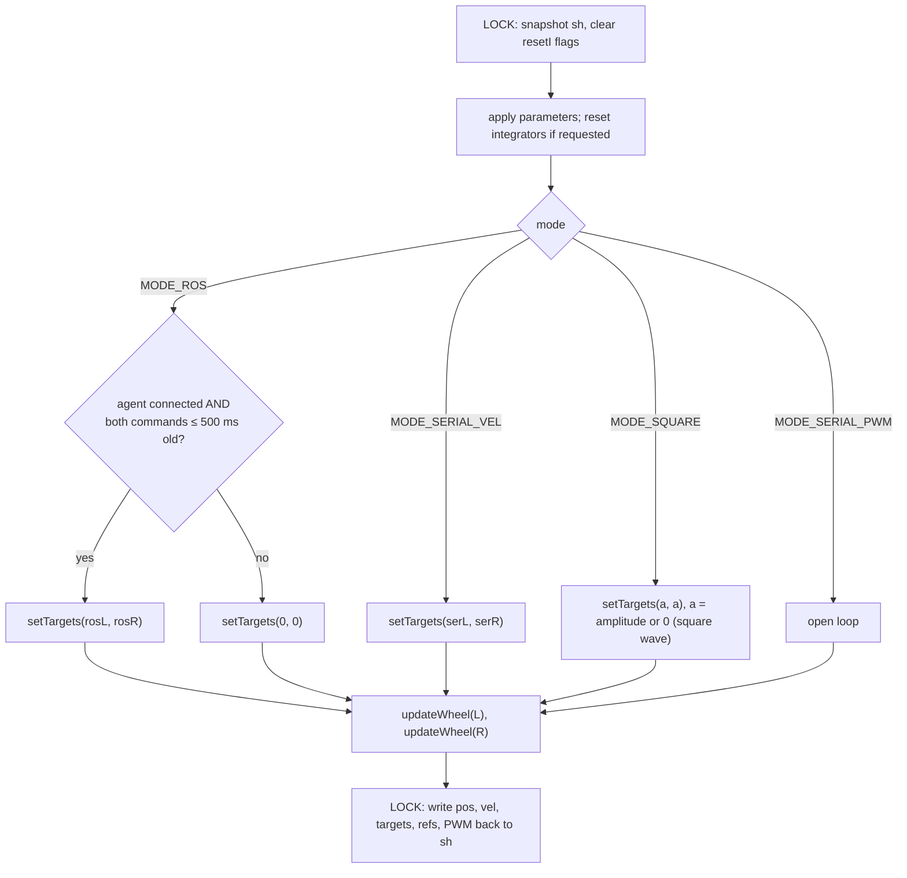

# ESP32 motor control

How the ESP32 turns a wheel speed target (rad/s) into motor PWM: task structure, the control law line by line,
command sources, safety logic, the serial console, and tuning.

Code: [`firmware/esp32/amr_esp32/amr_esp32.ino`](../../firmware/esp32/amr_esp32/amr_esp32.ino).
Encoder measurement is covered in [04-encoder-decoding.md](04-encoder-decoding.md), the ROS link in
[02-micro-ros-communication.md](02-micro-ros-communication.md).

---

## 1. Task structure and concurrency

| Execution context | Core / priority | Rate | Does |
|---|---|---|---|
| `controlTask` (FreeRTOS task, 4096-byte stack) | core 1, priority 3 | fixed 50 Hz (`vTaskDelayUntil`, 20 ms) | `controlStep(dt)`: encoders → targets → ramp → FF + PI → PWM/DIR |
| `loop()` (Arduino loopTask) | core 1 (Arduino default), priority 1 | as fast as possible (`delay(1)` per pass) | micro-ROS state machine, serial commands, serial output |
| Wi-Fi / TCP-IP stack | core 0 (ESP-IDF default) | | radio |

`controlTask` has a higher priority than the Arduino loop on the same core, so it preempts `loop()` exactly every 20 ms,
no matter what micro-ROS or the serial console is doing. `dt` is measured with `micros()` each cycle (≈ 0.020 s) and used in
the velocity, ramp and integral calculations.

**Shared state.** The two sides exchange data only through `Shared sh`, protected by a spinlock
(`portMUX_TYPE shMux`, `LOCK()`/`UNLOCK()` = `portENTER_CRITICAL`/`portEXIT_CRITICAL`):

| Written by `loop()` | Written by `controlTask` |
|---|---|
| `mode`, `agentConnected`, `rosL/rosR` + arrival times `rosLMs/rosRMs`, serial targets `serL/serR`, square-wave settings, parameters `pL/pR` (+ `resetI` flags) | `posL/posR` (rad), `velL/velR` (rad/s), `tgtL/tgtR` (limited target), `refL/refR` (ramped setpoint), `pwmL/pwmR` (signed PWM) |

Each control cycle copies the whole struct once (`Shared c = sh;`) inside the lock and works on the copy, so the lock is
held for microseconds and the control math never sees half-updated values.

## 2. One control cycle (`controlStep`)



### `setTargets(l, r)`: validation and speed limit
- Non-finite / absurd values (|x| ≥ 1e6) → 0.
- If either target exceeds its wheel's `maxSpeed` (17 rad/s), **both** are multiplied by the same factor
  `s = min(maxL/|l|, maxR/|r|)`. This keeps the ratio between the wheels, so the robot follows the same curve, just slower.
  (`amr_diff_drive` does the same scaling on the Pi with the same 17 rad/s limit.)

### `updateWheel(w, dt, openLoop, pwm)`: the control law

1. **Measure** (see [04-encoder-decoding.md](04-encoder-decoding.md)):
   `raw = 2π·(counts − lastCount)/(CPR·dt)`, `meas = 0.3·raw + 0.7·meas`, `pos = 2π·counts/CPR`.
2. **Open loop** (`pwm` serial command): target, ramp and integrator reset; PWM applied directly; return.
3. **Setpoint ramp:** `ref += clamp(target − ref, ±ACCEL_LIMIT·dt)` with `ACCEL_LIMIT = 40 rad/s²`
   → at most 0.8 rad/s change per 20 ms; 0 → 17 rad/s takes 0.43 s. Protects gearboxes and prevents wheel slip that would corrupt odometry.
4. **Stop condition:** if `target == 0` and `|ref| < 0.001`: `ref = 0`, integrator reset, PWM 0, return. No hum or creep at standstill.
5. **Feed-forward + PI:**
   ```
   e    = ref − meas
   ff   = kff·ref + sign(ref)·pwmMin          // open-loop estimate of the PWM needed for 'ref'
   pT   = kp·e
   iNew = clamp(I + ki·e·dt, ±I_LIMIT)         // I_LIMIT = 400 PWM counts
   u    = ff + pT + iNew
   ```
   - `kff` (PWM per rad/s) and `pwmMin` (static-friction offset) do most of the work: with good values the wheel is
     already close to the target before feedback acts. PI only corrects the remainder (load, battery voltage, friction changes).
6. **Anti-windup (conditional integration):** if `u > 1023` while `e > 0`, or `u < −1023` while `e < 0`, the integrator is
   **not** updated (`I` keeps its old value); otherwise `I = iNew`.
7. **Output:** `setMotor(w, round(ff + pT + I))`.

### `setMotor(w, u)`: driving the Cytron
- `u` is clamped to ±1023 and stored as `pwmOut` (for telemetry/plots).
- If the wheel's `motorInvert` is set, the sign is flipped (left wheel: `true`).
- `DIR` pin = HIGH for `u ≥ 0`, LOW otherwise; PWM duty = `|u|` on the PWM pin.

**PWM:** LEDC peripheral, 20 kHz (above hearing), 10-bit resolution (0–1023). The sketch supports both Arduino-ESP32 core
APIs: v3.x `ledcAttach(pin, freq, bits)` / `ledcWrite(pin, duty)`, v2.x `ledcSetup(ch, ...)` + `ledcAttachPin` / `ledcWrite(ch, duty)`
(channels 0 and 1).

The Cytron driver is used in **sign-magnitude** mode: one PWM input for speed, one DIR input for direction per channel.

## 3. Per-wheel parameters

| Parameter | Left (motor 1, 26.9:1) | Right (motor 2, 19.1:1) | Meaning |
|---|---|---|---|
| `KFF` | 49.72 | 43.54 | PWM per rad/s (feed-forward slope) |
| `PWM_MIN` | 11.8 | 12.0 | PWM added in the direction of motion (static friction) |
| `KP` | 30.0 | 25.0 | PWM per rad/s of error |
| `KI` | 12.5 | 10.0 | PWM per (rad/s·s) of accumulated error |
| `MAX_SPEED` | 17.0 | 17.0 | rad/s target limit |
| `CPR` | 752.6 | 536.1 | counts per wheel revolution |
| `ENC_INVERT` / `MOTOR_INVERT` | true / true | false / false | sign conventions (forward = positive) |

Motors: 12 V planetary geared DC motors with ME-37 7-PPR encoders; the right one is a PG36M555-19.2K (262 RPM no-load
≈ 27.4 rad/s, 45 N·cm), the left one has a 26.9:1 gearbox. If the left motor uses the same base motor, its no-load wheel speed is about
262 × 19.2 / 26.9 ≈ 187 RPM ≈ 19.6 rad/s, so the common 17 rad/s limit is set by the **left** wheel: it keeps both below
their no-load speeds with a little headroom for the PI loop (consistent with the left feed-forward needing ~84 % PWM at
17 rad/s, below).

Feed-forward alone at full speed: left `49.72·17 + 11.8 ≈ 857`, right `43.54·17 + 12 ≈ 752` PWM counts (84 % / 74 % of 1023),
leaving headroom for PI correction.

Global control constants: `LOOP_HZ 50`, `VEL_ALPHA 0.3`, `ACCEL_LIMIT 40.0`, `I_LIMIT 400`, `PWM_FREQ 20000`, `PWM_BITS 10`.

## 4. Command sources (modes)

| Mode | Entered by | Target source | Notes |
|---|---|---|---|
| `MODE_ROS` (boot default) | `ros` | `/left_vel`, `/right_vel` | zero unless connected **and** both commands ≤ `CMD_TIMEOUT_MS` (500 ms) old |
| `MODE_SERIAL_VEL` | `t L [R]`, `s` | serial targets | `s` = stop and hold, ROS ignored until `ros` |
| `MODE_SQUARE` | `sq A [period_ms]` | A ↔ 0 rad/s square wave (period ≥ 200 ms, default 2000) | step-response tuning; `sq 0` → stop |
| `MODE_SERIAL_PWM` | `pwm L R` | raw PWM −1023..1023 | PID bypassed; for checking direction and friction |

## 5. Serial console (115200 baud, newline)

| Command | Effect |
|---|---|
| `ros` | back to ROS control |
| `s` | stop and hold |
| `t 10` / `t 10 5` | closed-loop targets (rad/s) |
| `sq 10 2000` | square wave 10 ↔ 0 rad/s, 2 s period |
| `pwm 300 300` | open-loop PWM |
| `kp L 12` (keys: `kp ki kff min max`; wheel `L`/`R`/`B`) | set a parameter live; resets that wheel's integrator |
| `p` | print parameters |
| `plot 0` / `plot 1` / `plot 2` | 1 Hz status line / `L_ref,L_meas,R_ref,R_meas` at 25 Hz / plus `L_pwm%`, `R_pwm%` |

Status line (plot 0):
`[ROS OK |ROS] tgt L=  0.00 R=  0.00 | meas L=  0.00 R=  0.00 rad/s | pos L=    0.00 R=    0.00 rad | pwm L=    0 R=    0`

Live changes are RAM-only: copy tuned values into `L_*`/`R_*` and re-flash.

## 6. Safety summary

| Condition | Result |
|---|---|
| Boot / Wi-Fi connecting | control task running, targets 0, motors off |
| Agent not connected or lost | targets forced to 0; stored ROS targets cleared on disconnect |
| A velocity command older than 500 ms | both targets 0 |
| NaN / inf / absurd command | ignored (callback) or replaced by 0 (`setTargets`) |
| Target > 17 rad/s | both wheels scaled together |
| PWM saturation | clamped to ±1023, integrator frozen |

## 7. Tuning procedure (wheels off the ground)

1. **Directions:** `pwm 300 300`. Both wheels must turn forward; otherwise flip `*_MOTOR_INVERT`.
   `pos` must increase for both; otherwise flip `*_ENC_INVERT`.
2. **Friction offset (`min`):** raise `pwm` from 0 until the wheel just starts turning; that PWM ≈ `PWM_MIN`.
3. **Feed-forward (`kff`):** `kp B 0`, `ki B 0`, then `t 10`. Adjust `kff` until `meas ≈ 10`; check at `t 5` and `t 15`.
4. **PI:** `plot 1`, `sq 10 2000`. Raise `kp` until the step is fast without oscillation, then `ki` until the remaining
   steady-state error disappears within a few hundred ms. If it overshoots, lower `ki` first.
5. `p`, copy the values into the sketch, re-flash, `ros`.

## 8. Things to know when changing the code

- Keep everything the control task needs in `sh`; never call micro-ROS or `Serial` from `controlTask`.
- If you change `LOOP_HZ`, the velocity quantization changes (see the encoder guide) and `VEL_ALPHA`, `ACCEL_LIMIT·dt` scale with it.
- If you change `MAX_SPEED`, change `max_wheel_speed` in `amr_diff_drive/config/diff_drive.yaml` too.
- Motors with a different gearbox need a new `CPR` and a new `kff`/`min`/`kp`/`ki` set.
