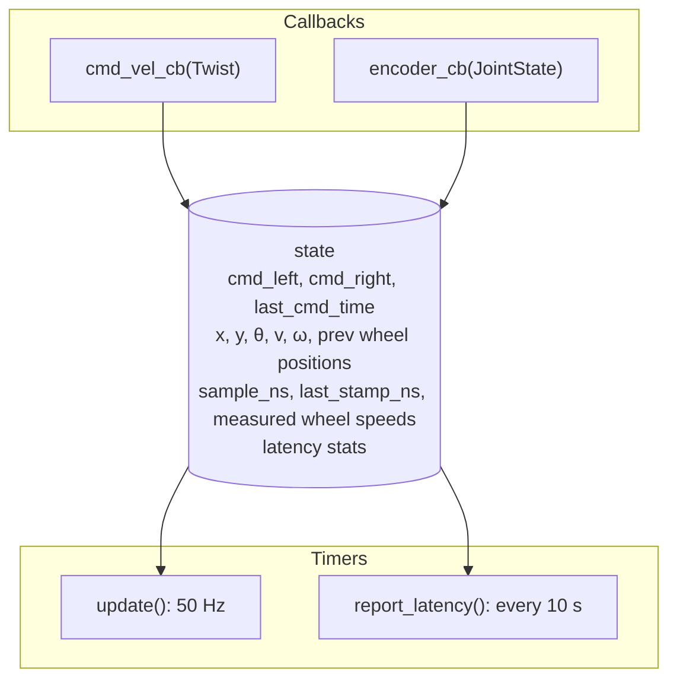

# Differential drive controller and hardware interface (`amr_diff_drive`)

The node between navigation and the ESP32: velocity commands → wheel setpoints, encoder data → odometry and TF.
It plays the roles that the ros2_control **hardware interface** and **diff_drive_controller** play in a standard ROS 2
robot (§9 explains that mapping and the ros2_control implementation that was tried first).

Code: [`amr_ws/src/amr_diff_drive/`](../../amr_ws/src/amr_diff_drive/)
- `amr_diff_drive/diff_drive_controller.py`: the ROS node (I/O, state, timers)
- `amr_diff_drive/kinematics.py`: pure math, no ROS imports, unit tested
- `config/diff_drive.yaml`: parameters · `launch/diff_drive.launch.py` · `test/test_kinematics.py`

Package README (usage, calibration, troubleshooting): [amr_diff_drive/README.md](../../amr_ws/src/amr_diff_drive/README.md).

---

## 1. Interfaces

| Direction | Topic | Type | QoS | Rate |
|---|---|---|---|---|
| in | `/cmd_vel` (param `cmd_vel_topic`) | `geometry_msgs/Twist` (only `linear.x`, `angular.z` used) | reliable, depth 10 | whatever the sender uses |
| in | `/encoder_telemetry` (param `encoder_topic`) | `sensor_msgs/JointState` | best effort (`qos_profile_sensor_data`) | 20 Hz from the ESP32 |
| out | `/left_vel`, `/right_vel` | `std_msgs/Float64`, rad/s | reliable, depth 10 | 50 Hz |
| out | `/odom` | `nav_msgs/Odometry` (`odom` → `base_link`) | reliable, depth 10 | 50 Hz |
| out | `/tf` | `odom → base_link` (if `publish_tf`) | TF broadcaster | 50 Hz |

Output topic names are fixed in code; input topics and frame names are parameters.
Launch: `ros2 launch amr_diff_drive diff_drive.launch.py [params_file:=...]` starts executable `diff_drive_controller`
(node name `diff_drive_controller`) with `config/diff_drive.yaml`.

## 2. Parameters (`config/diff_drive.yaml`, read once at startup)

| Parameter | Value | Used for |
|---|---|---|
| `wheel_radius` / `wheel_separation` | 0.056 / 0.39 m | all kinematics (must be > 0, else the node refuses to start) |
| `max_wheel_speed` | 17.0 rad/s | command limit, both wheels scaled together (≤ 0 disables) |
| `cmd_vel_timeout` | 0.5 s | wheels commanded to 0 if no `/cmd_vel` for this long |
| `invert_left_cmd` / `invert_right_cmd` | false | negate a wheel command (direction is handled in the firmware instead) |
| `encoder_topic`, `left_joint_name`, `right_joint_name` | `/encoder_telemetry`, `left_wheel`, `right_wheel` | encoder input, looked up by name |
| `invert_left_encoder` / `invert_right_encoder` | false | negate encoder position and velocity |
| `encoder_timeout` | 0.5 s | after this without encoder messages: twist reported 0, warning |
| `max_wheel_delta` | 10.0 rad | larger jump between two messages = encoder reset, ignored |
| `use_encoder_stamp` | true | use the ESP32 `header.stamp` + pose prediction |
| `max_stamp_offset` | 0.5 s | max \|receive − stamp\| to trust the stamp |
| `max_extrapolation_time` | 0.2 s | max prediction horizon |
| `latency_report_period` | 10.0 s | latency statistics log (0 disables) |
| `cmd_vel_topic` | `/cmd_vel` | |
| `publish_rate` | 50.0 Hz | timer for all outputs (must be > 0) |
| `odom_frame` / `base_frame` | `odom` / `base_link` | |
| `publish_tf` | true | set false if another node (e.g. an EKF) owns `odom → base_link` |
| `pose_covariance_diagonal` / `twist_covariance_diagonal` | `[0.001, 0.001, 1e6, 1e6, 1e6, 0.01]` | covariance diagonals (x, y, z, roll, pitch, yaw); 1e6 = "not measured" |

Validation at startup: radius/separation > 0, rate > 0, covariance lists of 6, offsets/periods ≥ 0 (`ValueError` otherwise).

## 3. Node structure



A single-threaded `rclpy.spin()` runs all callbacks, so no locking is needed.

## 4. Command path: `/cmd_vel` → `/left_vel`, `/right_vel`

`cmd_vel_cb`:
1. `v = linear.x`, `ω = angular.z`; non-finite values are ignored with a throttled warning.
2. `twist_to_wheels(v, ω, r, L, max_wheel_speed)`:
   ```
   ω_L = (v − ω·L/2) / r
   ω_R = (v + ω·L/2) / r
   if max(|ω_L|, |ω_R|) > max_wheel_speed:  scale both by max_wheel_speed / max(|ω_L|, |ω_R|)
   ```
   Scaling both keeps v/ω constant, i.e. the same path curvature at a lower speed.
3. Optional sign inversion, store `cmd_left`, `cmd_right`, `last_cmd_time = now`.

`update()` (50 Hz): if no command yet or `now − last_cmd_time > cmd_vel_timeout` (0.5 s) → both commands 0.
Then publish both. The wheel commands are therefore sent **continuously at 50 Hz**, which keeps the ESP32's 500 ms
command watchdog satisfied, and stop within 0.5 s of the last `/cmd_vel`.

Limits of the robot at 17 rad/s: max straight speed `17·0.056 = 0.952 m/s`, max spin `2·17·0.056/0.39 ≈ 4.88 rad/s`.

On shutdown (Ctrl-C), `main()` publishes 0.0 on both wheels once before destroying the node.

## 5. Odometry path: `/encoder_telemetry` → pose

`encoder_cb`:
1. Find `left_wheel`/`right_wheel` in `msg.name` (by name); if missing, or no positions, or non-finite → warn (throttled) and ignore.
2. Apply the encoder inversion flags to position and velocity. Velocities default to 0 if the field is missing or non-finite.
3. `last_enc_time = now` (receive time, used for the staleness watchdog).
4. Measurement time (§6) → `sample_ns`; store measured wheel speeds.
5. **First message:** latch `prev_left_pos`, `prev_right_pos`, log `First encoder sample: ...`, return.
   The pose starts at (0, 0, 0) whatever the absolute encoder values are.
6. `ΔL = left − prev_left`, `ΔR = right − prev_right`, update the previous values.
7. If |ΔL| or |ΔR| > `max_wheel_delta` (10 rad): encoder reset/glitch (e.g. ESP32 reboot → counts restart at 0).
   The pose is **not** moved; the new values are already the reference; warning logged.
8. `integrate_pose(x, y, θ, ΔL, ΔR, r, L)` and `wheels_to_twist(ω_L, ω_R, r, L)` for the twist.

**Exact arc integration** (`integrate_pose`):
```
Δs = r(ΔR + ΔL)/2           # distance travelled by base_link
Δθ = r(ΔR − ΔL)/L           # heading change
if |Δθ| < 1e-6:             # straight: midpoint formula
    x += Δs·cos(θ + Δθ/2);  y += Δs·sin(θ + Δθ/2)
else:                       # constant-curvature arc of radius Δs/Δθ
    x += (Δs/Δθ)·(sin(θ+Δθ) − sin θ)
    y −= (Δs/Δθ)·(cos(θ+Δθ) − cos θ)
θ = atan2(sin(θ+Δθ), cos(θ+Δθ))     # wrapped to [−π, π]
```
Exact for constant wheel speeds during an interval; the unit tests check a full circle in 1000 steps returns to the
origin within 1e-9 and a single quarter-arc step lands exactly on (1, 1, π/2).

**Why positions and not velocities:** integrating position differences can't drift from timing jitter or lost packets;
a missing message just makes the next difference larger. Velocities are only used for the reported twist and the prediction.

**Twist:** `v = r(ω_R + ω_L)/2`, `ω = r(ω_R − ω_L)/L` from the measured wheel speeds (in `base_link`).

## 6. Latency compensation with the ESP32 timestamp

An encoder sample reaches the Pi tens to hundreds of ms (28 Sep log: 10-s window means of 15–242 ms (median 81 ms), single samples up to 410 ms) after it was measured. Publishing the pose stamped
"now" would show where the robot *was*; LiDAR scans matched against it would be smeared during turns. So:

**Step 1, trust the stamp or not** (`select_sample_time(stamp_ns, receive_ns, last_stamp_ns, max_offset_ns)`):

| Check | If it fails |
|---|---|
| stamp > 0 | `zero stamp` |
| stamp > previous stamp | `stamp not increasing` |
| \|receive − stamp\| ≤ 0.5 s | `stamp offset X s (ESP32 clock not synced to Pi?)` |

Accepted → `sample_ns = stamp` and latency statistics updated. Rejected → `sample_ns = receive time`, counter incremented,
throttled warning. The integrated pose is the pose **at `sample_ns`**.

**Step 2, predict to now** (in `update()`): `age = now − sample_ns`. If `use_encoder_stamp`, encoders not stale and
`0 < age ≤ max_extrapolation_time` (0.2 s):
`pose_published = integrate_pose(pose, ω_L·age, ω_R·age)` (`predict_pose`). Otherwise the measured pose is published.
The prediction is **never written back**, so its errors can't accumulate.

**Step 3, statistics** every 10 s: `encoder latency ms: min 6.2 / mean 18.4 / max 85.1, stamps rejected 0/145`
(or a warning if all were rejected).

Simulated test from the package README (60 ms latency, arc at 0.5 m/s, 1 rad/s): mean error 39.3 mm / 4.51° without
compensation, 0.1 mm / 0.01° with it.

## 7. Publishing (`update()`, 50 Hz)

1. Command watchdog → publish `/left_vel`, `/right_vel`.
2. Encoder watchdog: no message for > 0.5 s (or none yet) → `v = ω = 0`, warning `Encoder telemetry stale` (every 2 s); pose kept.
3. Prediction (§6).
4. `/odom`: stamp = node clock now, `frame_id = odom`, `child_frame_id = base_link`, position (x, y), orientation from yaw
   (`yaw_to_quaternion`: `(0, 0, sin(θ/2), cos(θ/2))`), twist (v, ω), covariance diagonals at indices 0, 7, 14, 21, 28, 35.
5. TF `odom → base_link` with the same stamp and pose.

All outputs share one stamp from one timer, so stamps are monotonic, exactly 50 Hz apart, and there's no
`TF_REPEATED_DATA` spam.

## 8. Tests

`test/test_kinematics.py`, 20 pytest cases (`python3 -m pytest -q test` in the package, or `colcon test`):
inverse kinematics, speed-limit curvature preservation, forward/inverse round trip, straight/circle/quarter-arc
integration, stamp conversion, all stamp accept/reject cases, prediction for zero/negative/over-limit ages, straight line and spin.

## 9. Hardware interface: how this maps to ros2_control

In the standard ROS 2 architecture (and the project's early design slides), the base is split into:

| ros2_control piece | Job | In this robot |
|---|---|---|
| **Hardware interface** (`SystemInterface` plugin) | Talks to the actual hardware; exposes *command interfaces* (`left_wheel_joint/velocity`) and *state interfaces* (`.../position`, `.../velocity`) | The ESP32 topics are the hardware: `amr_diff_drive` writes `/left_vel`, `/right_vel` and reads `/encoder_telemetry` directly |
| **diff_drive_controller** | `/cmd_vel` → wheel velocity commands; wheel states → odometry + TF | `cmd_vel_cb` + `update()` (§4) and `encoder_cb` + `integrate_pose` (§5) |
| **controller_manager** | Runs `read() → update() → write()` at a fixed rate | The node's 50 Hz timer |

### The ros2_control version that was tried first
`learning/iteration-phase/differential_drive/src/my_amr_control_pkg/` (dropped; kept for reference):
- `MyAMRHardwareInterface` (`hardware_interface::SystemInterface`, exported with pluginlib as `my_amr_control_pkg/MyAMRHardwareInterface`).
- `on_init`: one command (velocity) and two state (position, velocity) values per joint; creates an internal node
  `amr_hw_bridge_node` with publishers `/left_vel`, `/right_vel` and a `SensorDataQoS` subscription to `/encoder_telemetry`
  that stores positions/velocities by joint name.
- `read()`: `rclcpp::spin_some(hw_node_)`, then copies the latest encoder values into the state interfaces.
- `write()`: publishes the two velocity commands.
- URDF `amr_robot.urdf.xacro` with `left_wheel_joint`/`right_wheel_joint` and a `<ros2_control>` block;
  `controllers.yaml`: `update_rate: 50`, `joint_state_broadcaster`, `diff_drive_base_controller`
  (separation 0.39, radius 0.056, `open_loop: false`, `position_feedback: true`, `use_stamped_vel: false`);
  the launch file remaps `/diff_drive_base_controller/cmd_vel_unstamped` → `/cmd_vel`.

Why it was replaced: [learning/approach-documentation/software.md §1](../../../learning/approach-documentation/software.md)
(mainly: no use of the ESP32 timestamps, extra configuration layers, a ROS node spun inside `read()`).

**Never run both**: each publishes `odom → base_link` and `/left_vel`, `/right_vel`.
