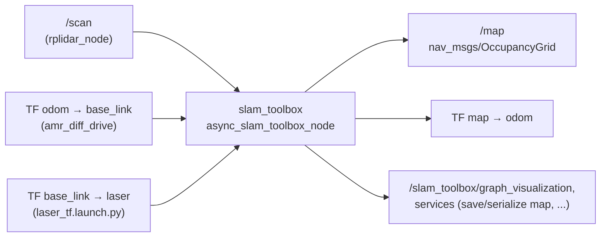

# SLAM Toolbox (mapping)

How the robot builds a map: the node, inputs and outputs, every parameter in the config, how mapping works internally,
saving and reusing maps, and the alternative config.

Code: [`amr_navigation/launch/slam.launch.py`](../../amr_ws/src/amr_navigation/launch/slam.launch.py),
[`amr_navigation/config/slam_toolbox_params.yaml`](../../amr_ws/src/amr_navigation/config/slam_toolbox_params.yaml),
[`amr_navigation/config/mapper_params_real.yaml`](../../amr_ws/src/amr_navigation/config/mapper_params_real.yaml) (alternative).
SLAM Toolbox itself comes from apt (`ros-humble-slam-toolbox`).

---

## 1. How it's started

`./amr_bringup.sh slam` → after agent, laser TF, diff drive and LiDAR are up: `ros2 launch amr_navigation slam.launch.py`
(log `~/amr_logs/slam.log`).

`slam.launch.py` starts one node:
```python
Node(package='slam_toolbox', executable='async_slam_toolbox_node', name='slam_toolbox',
     parameters=[slam_params, {'use_sim_time': False}])
```
Launch argument `slam_params_file` (default `<share>/config/slam_toolbox_params.yaml`).

Also available: `nav_slam.launch.py` = the same SLAM node + Nav2's `navigation_launch.py` started 5 s later
(`nav2_start_delay`), for navigating while mapping.

## 2. Inputs and outputs



SLAM Toolbox reads the odometry **from TF**, not from the `/odom` topic: for each scan it looks up `odom → base_link`
at the scan's timestamp. That's why accurate, latency-compensated odometry TF matters (see
[05-diff-drive-controller.md §6](05-diff-drive-controller.md)).

It publishes `map → odom` (not `map → base_link`), so the chain stays `map → odom → base_link → laser` and the
diff drive node keeps owning `odom → base_link`.

## 3. How it works (online asynchronous, graph-based)

1. **Motion gate:** a new scan is processed only if the robot moved ≥ `minimum_travel_distance` or turned
   ≥ `minimum_travel_heading` since the last processed scan (and `minimum_time_interval` passed).
2. **Scan matching:** the odometry pose is the initial guess; the scan is correlated against a rolling buffer of recent
   scans (`scan_buffer_size`), first on a coarse grid, then fine (`correlation_search_space_*`,
   `coarse_angle_resolution`, `fine_search_angle_offset`). Penalties keep the result close to odometry
   (`distance_variance_penalty`, `angle_variance_penalty`).
3. **Pose graph:** each processed scan becomes a node; matched poses add edges (constraints).
4. **Loop closure:** near earlier parts of the graph (within `loop_search_maximum_distance`), the current scans are matched
   against old ones in a large window (`loop_search_space_*`); a match good enough (`loop_match_*` thresholds, chain of at
   least `loop_match_minimum_chain_size` scans) adds a loop edge.
5. **Optimization:** Ceres solves the graph to spread the accumulated drift over all poses.
6. **Map:** the occupancy grid is rebuilt from all scans at their optimized poses every `map_update_interval` and
   published on `/map`; `map → odom` is updated every `transform_publish_period`.

"Asynchronous" means that if processing falls behind, scans are dropped rather than queued: good for a Raspberry Pi.

## 4. `slam_toolbox_params.yaml` explained (used by the bringup)

Based on SLAM Toolbox's `mapper_params_online_async.yaml`, with frames and timing set for this robot.

**Solver**

| Parameter | Value | Meaning |
|---|---|---|
| `solver_plugin` | `solver_plugins::CeresSolver` | graph optimizer |
| `ceres_linear_solver` / `ceres_preconditioner` | `SPARSE_NORMAL_CHOLESKY` / `SCHUR_JACOBI` | sparse solver settings |
| `ceres_trust_strategy` / `ceres_dogleg_type` | `LEVENBERG_MARQUARDT` / `TRADITIONAL_DOGLEG` | non-linear least squares strategy |
| `ceres_loss_function` | `None` | no robust loss |

**ROS / frames / timing**

| Parameter | Value | Meaning |
|---|---|---|
| `odom_frame`, `map_frame`, `base_frame` | `odom`, `map`, `base_link` | must match the TF tree |
| `scan_topic` | `/scan` | |
| `mode` | `mapping` | (`localization` to localize on a serialized map) |
| `use_sim_time` | false | wall clock |
| `debug_logging` | false | |
| `throttle_scans` | 1 | process every scan that passes the motion gate |
| `transform_publish_period` | 0.02 s | publish `map → odom` at 50 Hz |
| `map_update_interval` | 5.0 s | rebuild/publish `/map` every 5 s (kept high for the Pi) |
| `resolution` | 0.05 m | map cell size |
| `max_laser_range` | 12.0 m | longer returns ignored for mapping (RPLIDAR A1 range) |
| `minimum_time_interval` | 0.5 s | at most 2 processed scans per second |
| `transform_timeout` | 0.3 s | how long to wait for `odom → base_link` at the scan time (odometry arrives over Wi-Fi) |
| `tf_buffer_duration` | 30.0 s | TF history |
| `stack_size_to_use` | 40000000 | 40 MB thread stack for serialization of large maps |
| `enable_interactive_mode` | true | allows manual graph edits from the RViz plugin |

**Motion gate and scan buffer**

| Parameter | Value | Meaning |
|---|---|---|
| `use_scan_matching` / `use_scan_barycenter` | true / true | correct odometry by scan matching; use the scan's centroid for distances |
| `minimum_travel_distance` | 0.3 m | process a scan after 30 cm of travel … |
| `minimum_travel_heading` | 0.3 rad | … or ~17° of rotation |
| `scan_buffer_size` | 10 | recent scans used for matching |
| `scan_buffer_maximum_scan_distance` | 10.0 m | |
| `link_match_minimum_response_fine` | 0.1 | min match quality to link consecutive scans |
| `link_scan_maximum_distance` | 1.5 m | |

**Loop closure**

| Parameter | Value |
|---|---|
| `do_loop_closing` | true |
| `loop_search_maximum_distance` | 3.0 m |
| `loop_match_minimum_chain_size` | 10 |
| `loop_match_maximum_variance_coarse` | 3.0 |
| `loop_match_minimum_response_coarse` / `_fine` | 0.35 / 0.45 |
| `loop_search_space_dimension` / `_resolution` / `_smear_deviation` | 8.0 m / 0.05 m / 0.03 |

**Scan matcher**

| Parameter | Value |
|---|---|
| `correlation_search_space_dimension` / `_resolution` / `_smear_deviation` | 0.5 m / 0.01 m / 0.1 |
| `distance_variance_penalty` / `angle_variance_penalty` | 0.5 / 1.0 |
| `fine_search_angle_offset` / `coarse_search_angle_offset` / `coarse_angle_resolution` | 0.00349 / 0.349 / 0.0349 rad |
| `minimum_angle_penalty` / `minimum_distance_penalty` | 0.9 / 0.5 |
| `use_response_expansion` | true |

## 5. Alternative config: `mapper_params_real.yaml`

The first SLAM config (from the old `amr_slam` package). Differences from the default:
`minimum_travel_distance`/`heading` **0.05** (≈ 6× more scans processed: denser map, more CPU), default `transform_timeout`
(0.2 s), and `minimum_laser_range`/`maximum_laser_range`, which are **not** SLAM Toolbox parameters and are ignored
(effective `max_laser_range` = default 20 m). Everything else is at the SLAM Toolbox defaults.

```bash
ros2 launch amr_navigation slam.launch.py \
  slam_params_file:=$(ros2 pkg prefix amr_navigation)/share/amr_navigation/config/mapper_params_real.yaml
```

## 6. Making a good map

1. `./amr_bringup.sh slam`; on the laptop RViz with fixed frame `map`, displays Map (`/map`), LaserScan, TF.
2. Drive slowly (`ros2 run amr_teleop wasd_teleop`: 0.1 m/s, 1.0 rad/s), turn gently in open space.
3. Revisit the start and earlier areas to close loops; watch the map snap into alignment.
4. Save:
   ```bash
   ros2 run nav2_map_server map_saver_cli -f ~/amr/maps/<name>
   ```
   → `<name>.pgm` (image: white free, black occupied, grey unknown) + `<name>.yaml`:
   ```yaml
   image: <name>.pgm        # relative to the yaml
   mode: trinary
   resolution: 0.05
   origin: [x, y, 0]        # map position of the lower-left pixel
   negate: 0
   occupied_thresh: 0.65
   free_thresh: 0.25
   ```
5. Navigate on it: `MAP=$HOME/amr/maps/<name>.yaml ./amr_bringup.sh`.

Optional: RViz → Panels → SlamToolboxPlugin → **Serialize Map** saves the pose graph (`.posegraph`/`.data`) to continue
mapping later (`mode: mapping` with `map_file_name` + `map_start_pose`) or to localize with SLAM Toolbox (`mode: localization`).

## 7. Troubleshooting

| Symptom | Cause / fix |
|---|---|
| No `/map`, log shows TF timeouts / "Failed to compute odom pose" | `odom → base_link` missing or late: check `amr_diff_drive`, raise `transform_timeout` |
| Map smears or doubles when turning | laser TF yaw wrong; odometry latency/calibration; turn slower |
| Map drifts, loops don't close | calibrate wheel radius/separation; revisit areas; lower `loop_match_minimum_response_*` carefully |
| Map updates slowly | `map_update_interval` is 5 s by design; lower it if the Pi can afford it |
| Pi CPU overloaded | keep 0.3 m / 0.3 rad gating; raise `minimum_time_interval` |
