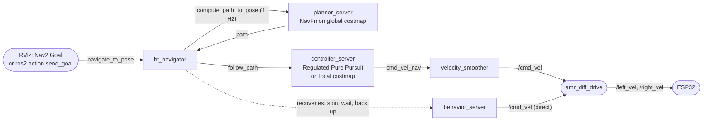

# Nav2 (localization and autonomous navigation)

How the robot localizes on a saved map and drives to goals: what gets launched, the lifecycle, the command chain down to
the wheels, and every parameter group in `nav2_params.yaml`.

Code: [`amr_navigation/launch/nav_map.launch.py`](../../amr_ws/src/amr_navigation/launch/nav_map.launch.py),
[`nav_slam.launch.py`](../../amr_ws/src/amr_navigation/launch/nav_slam.launch.py),
[`config/nav2_params.yaml`](../../amr_ws/src/amr_navigation/config/nav2_params.yaml).
Nav2 itself comes from apt (`ros-humble-navigation2`, `ros-humble-nav2-bringup`; checked against version 1.1.20).
Package README (first-run test order, tuning table, troubleshooting): [amr_navigation/README.md](../../amr_ws/src/amr_navigation/README.md).

---

## 1. What gets launched

`./amr_bringup.sh` (nav mode) runs, after the robot base and LiDAR are up:
```bash
ros2 launch amr_navigation nav_map.launch.py map:=<MAP> use_composition:=True 2>&1 | grep -v RTPS_READER_HISTORY
```
`nav_map.launch.py` includes Nav2's `nav2_bringup/launch/bringup_launch.py` with:
`slam:=False`, `map:=<MAP>`, `use_sim_time:=false`, `params_file:=config/nav2_params.yaml`, `autostart:=true`,
`use_composition:=True`. (Launch arguments: `map` (default `<share>/maps/map.yaml`, always overridden by the bringup),
`params_file`, `use_composition` (default False).)

`bringup_launch.py` then:
- starts one container process `nav2_container` (`rclcpp_components/component_container_isolated`, each node in its own
  executor thread) because `use_composition` is true, and loads every Nav2 node into it (saves RAM on the Pi);
- includes `localization_launch.py`: `map_server`, `amcl`, `lifecycle_manager_localization`;
- includes `navigation_launch.py`: `controller_server`, `smoother_server`, `planner_server`, `behavior_server`,
  `bt_navigator`, `waypoint_follower`, `velocity_smoother`, `lifecycle_manager_navigation`;
- substitutes `use_sim_time` and the map path (`yaml_filename`) into the parameter file.

The `grep -v RTPS_READER_HISTORY` only hides a noisy Fast DDS warning in the output.

### Lifecycle

All Nav2 servers are *lifecycle nodes* (unconfigured → inactive → active). With `autostart: true` each lifecycle manager
configures and activates its nodes in order and then keeps a bond to them. The bringup script waits for the log line
`lifecycle_manager_localization ... Managed nodes are active` and then prints `Localization ACTIVE`; it reports a failure
on `Aborting bringup` or if the process exits.
Check a node: `ros2 lifecycle get /controller_server` → `active [3]`.

## 2. From a goal to the wheels



Remappings in Humble's `navigation_launch.py`: controller_server `cmd_vel → cmd_vel_nav`; velocity_smoother
`cmd_vel → cmd_vel_nav` (input) and `cmd_vel_smoothed → cmd_vel` (output). `behavior_server` has **no** remapping, so
recovery motions publish `/cmd_vel` directly, bypassing the smoother. Only Nav2 may publish `/cmd_vel` while it runs;
teleop at the same time would fight it (no `twist_mux` in this setup).

### Default behavior tree (Humble `navigate_to_pose_w_replanning_and_recovery.xml`)

No `default_nav_to_pose_bt_xml` / `plugin_lib_names` are set, so Humble's default tree is used
(`nav2_bt_navigator/behavior_trees/navigate_to_pose_w_replanning_and_recovery.xml`, checked against 1.1.20):
- **Replan** at 1 Hz (`ComputePathToPose`, planner `GridBased`) while **following** the path (`FollowPath`, controller `FollowPath`).
- If planning fails: clear the global costmap once and retry. If following fails: clear the local costmap once and retry.
- If that still fails, the top-level recovery (up to **6 retries**) runs the next action in a round robin, then tries again:
  1. clear local + global costmaps, 2. **spin** 1.57 rad, 3. **wait** 5 s, 4. **back up** 0.30 m at 0.05 m/s.
- A new goal (`GoalUpdated`) interrupts recovery immediately.

## 3. Localization: map_server + AMCL

**map_server** loads `<MAP>.yaml` (+ `.pgm`) and publishes `/map` once, transient-local (late subscribers still get it).

**AMCL** (adaptive Monte Carlo localization) keeps a particle cloud of possible robot poses on the map, moves the particles
with odometry, weights them by how well the LiDAR scan fits the map, resamples, and publishes `map → odom` so that
`map → base_link` equals the best estimate.

| Group | Parameters | Meaning |
|---|---|---|
| Frames / model | `robot_model_type: nav2_amcl::DifferentialMotionModel`, `global_frame_id: map`, `odom_frame_id: odom`, `base_frame_id: base_link`, `scan_topic: scan`, `tf_broadcast: true` | publishes `map → odom` |
| TF | `transform_tolerance: 0.5` | stamps `map → odom` 0.5 s into the future (generous because odometry arrives over Wi-Fi) |
| Odometry noise | `alpha1..alpha5: 0.2` | how much AMCL distrusts odometry (rotation from rotation, rotation from translation, translation from translation, translation from rotation; alpha5 unused for diff drive). Raise if odometry is poor |
| Laser model | `laser_model_type: likelihood_field`, `laser_min_range 0.15`, `laser_max_range 12.0`, `laser_likelihood_max_dist 2.0`, `max_beams 60`, `z_hit 0.5`, `z_rand 0.5`, `z_short 0.05`, `z_max 0.05`, `sigma_hit 0.2`, `lambda_short 0.1`, beam skipping off | 60 beams per scan evaluated against a distance field of the map |
| Particles | `min_particles 300`, `max_particles 1500`, `pf_err 0.05`, `pf_z 0.99`, `resample_interval 1` | KLD sampling between 300 and 1500 (below Nav2's default 2000 to save CPU) |
| Recovery | `recovery_alpha_fast/slow: 0.0` | no random particle injection (no automatic "kidnapped robot" recovery) |
| Update gate | `update_min_d 0.15`, `update_min_a 0.2` | filter update only after 15 cm or 0.2 rad of motion |
| Initial pose | `set_initial_pose: false`, `save_pose_rate 0.5` | give the start pose with **2D Pose Estimate** in RViz |

Because AMCL only updates after motion, the cloud converges as the robot drives after the initial pose is set.

## 4. Costmaps

| | Local costmap | Global costmap |
|---|---|---|
| Frame | `odom` (smooth, no AMCL jumps) | `map` |
| Size | 3 × 3 m rolling window around the robot | whole map (`track_unknown_space: true`) |
| Resolution | 0.05 m | 0.05 m |
| Update / publish | 5 Hz / 2 Hz | 1 Hz / 1 Hz |
| Layers | `obstacle_layer`, `inflation_layer` | `static_layer` (the map, transient-local), `obstacle_layer`, `inflation_layer` |
| Footprint | `[[0.25,0.23],[0.25,-0.23],[-0.25,-0.23],[-0.25,0.23]]` (0.50 × 0.46 m, placeholder) + 0.02 m padding | same |
| TF tolerance | 0.3 s | 0.3 s |

**Obstacle layer** (both), observation source `scan`: topic `/scan`, `LaserScan`, marking + clearing,
`obstacle_max_range 2.5` m (mark), `raytrace_max_range 3.0` m (clear; must be ≥ the marking range so old obstacles are
removed), min ranges 0, `inf_is_valid: false` (no-return beams don't clear), `footprint_clearing_enabled: true`.

**Inflation layer** (both): `inflation_radius 0.40` m, `cost_scaling_factor 3.0`: cost decays exponentially away from
obstacles; planners and the controller prefer paths through low cost.

`always_send_full_costmap: true` in both (RViz gets full updates).

## 5. Planner: NavFn (`planner_server`)

`expected_planner_frequency 5.0`, plugin `GridBased` = `nav2_navfn_planner/NavfnPlanner`: Dijkstra (`use_astar: false`)
on the global costmap, `tolerance 0.5` m (plans to the nearest reachable point within 0.5 m if the goal is blocked),
`allow_unknown: true` (may plan through unexplored cells).

The `smoother_server` (`nav2_smoother::SimpleSmoother`, `tolerance 1e-10`, `max_its 1000`, `do_refinement: true`) is loaded
but the default behavior tree doesn't call it.

## 6. Controller: Regulated Pure Pursuit (`controller_server`)

Server: `controller_frequency 10.0` Hz, `odom_topic /odom` (current speed), velocity thresholds
(`min_x 0.001`, `min_theta 0.001`; `min_y 0.5` irrelevant for a diff drive), `failure_tolerance 0.3` s.

- **Progress checker** (`SimpleProgressChecker`): must move 0.3 m within 15 s, else the BT triggers recovery.
- **Goal checker** (`SimpleGoalChecker`, `stateful: true`): done within 0.15 m and 0.25 rad (~15°); once the position is
  reached it only rotates.

**Pure pursuit idea:** pick a "carrot" point on the path one lookahead distance ahead and drive the arc that hits it:
`ω = v · 2·sin(α)/Ld` (curvature from the angle α to the carrot). "Regulated" = the linear speed is reduced when needed.

| Group | Parameters |
|---|---|
| Speed | `desired_linear_vel 0.25` m/s (cruise), `allow_reversing: false` |
| Lookahead | `lookahead_dist 0.5`, `min 0.3`, `max 0.8` m; `use_velocity_scaled_lookahead_dist: true` with `lookahead_time 1.5` s (Ld = v·1.5 clamped to [0.3, 0.8]); `use_interpolation: true` (carrot interpolated between path points) |
| Rotate first | `use_rotate_to_heading: true`: if the path direction differs by more than `rotate_to_heading_min_angle 0.785` rad (45°), turn in place at `rotate_to_heading_angular_vel 0.8` rad/s, `max_angular_accel 1.5` rad/s² |
| Curvature regulation | `use_regulated_linear_velocity_scaling: true`: slow down on curves tighter than `regulated_linear_scaling_min_radius 0.9` m, not below `regulated_linear_scaling_min_speed 0.1` m/s |
| Cost regulation | `use_cost_regulated_linear_velocity_scaling: true`, `cost_scaling_dist 0.4`, `cost_scaling_gain 1.0`, `inflation_cost_scaling_factor 3.0` (**must equal** the inflation layer's `cost_scaling_factor`): slow down near obstacles |
| Goal approach | slow down within `approach_velocity_scaling_dist 0.6` m, down to `min_approach_linear_velocity 0.05` m/s |
| Collision check | `use_collision_detection: true`, `max_allowed_time_to_collision_up_to_carrot 1.0` s: stop if the footprint would hit something within 1 s along the arc |
| Misc | `transform_tolerance 0.3`, `max_robot_pose_search_dist 10.0` |

## 7. Velocity smoother

`smoothing_frequency 20.0` Hz, `feedback: OPEN_LOOP` (limits applied to the last command, not measured odometry),
`scale_velocities: false`.

| | vx (m/s) | vy | ωz (rad/s) |
|---|---|---|---|
| `max_velocity` | 0.25 | 0 | 1.0 |
| `min_velocity` | −0.15 | 0 | −1.0 |
| `max_accel` | 0.5 | 0 | 1.5 |
| `max_decel` | −0.5 | 0 | −1.5 |

`velocity_timeout 1.0` s (publishes zero if the controller stops sending), `deadband_velocity [0,0,0]`,
`odom_topic /odom` + `odom_duration 0.1` (only used in closed-loop mode).
To drive faster, raise `desired_linear_vel` **and** `max_velocity[0]` together.

## 8. Behaviors, BT navigator, waypoints

- **behavior_server:** plugins `spin`, `backup`, `drive_on_heading`, `wait`; works on the local costmap
  (`costmap_topic local_costmap/costmap_raw`, `footprint_topic local_costmap/published_footprint`), frame `odom`,
  `cycle_frequency 10`, `simulate_ahead_time 2.0` s (collision check), spin limits `max_rotational_vel 0.8`,
  `min_rotational_vel 0.3`, `rotational_acc_lim 1.5`.
- **bt_navigator:** `global_frame map`, `robot_base_frame base_link`, `odom_topic /odom`, `bt_loop_duration 10` ms,
  `default_server_timeout 20` ms, `transform_tolerance 0.3`.
- **waypoint_follower:** `loop_rate 20`, `stop_on_failure: false`, pauses 200 ms at each waypoint (`WaitAtWaypoint`).
- **map_saver:** `save_map_timeout 5.0`, thresholds free 0.25 / occupied 0.65, transient-local subscription.

## 9. Operating it

```bash
# Pi
./amr_bringup.sh                                   # or MAP=/abs/path.yaml ./amr_bringup.sh
# laptop (same ROS_DOMAIN_ID)
ros2 launch nav2_bringup rviz_launch.py
```
1. **2D Pose Estimate**: click the robot's real position and drag in its heading; drive a little so AMCL converges.
2. **Nav2 Goal**: click and drag. Or from a terminal:
   ```bash
   ros2 action send_goal /navigate_to_pose nav2_msgs/action/NavigateToPose \
     "{pose: {header: {frame_id: map}, pose: {position: {x: 1.0, y: 0.0}, orientation: {w: 1.0}}}}" --feedback
   ```
3. Stop: cancel the goal in RViz, or Ctrl-C the bringup (the diff drive zeroes the wheels within 0.5 s).

Useful RViz displays: Map, LaserScan `/scan`, `/local_costmap/costmap`, `/global_costmap/costmap`, `/plan`,
`/local_plan`, ParticleCloud `/particle_cloud`, TF.

**Navigate while mapping** (no saved map): `ros2 launch amr_navigation nav_slam.launch.py` instead of the nav step:
SLAM Toolbox provides `/map` and `map → odom`, Nav2's `navigation_launch.py` starts 5 s later (no AMCL, no initial pose needed).

**Pre-flight check:** `ros2 run amr_navigation check_setup.sh` (topics exist and flow, `/cmd_vel` has a subscriber,
`odom → base_link` and `base_link → laser` exist, exactly one publisher of `odom → base_link`).

## 10. Tuning quick reference

| Want | Change |
|---|---|
| Faster | `desired_linear_vel` and `velocity_smoother.max_velocity[0]` (0.25 → 0.35 → 0.5, one step at a time) |
| Faster turns | `rotate_to_heading_angular_vel`, `max_velocity[2]` |
| Keep further from walls | raise `inflation_radius`, lower `cost_scaling_factor` (and `inflation_cost_scaling_factor` to the same value) |
| Fit through doors | measure the real footprint first; then lower `inflation_radius` (0.40 → 0.30) |
| Cuts corners / wobbles | lower / raise the lookahead distances |
| Stops short or oscillates at the goal | raise `xy_goal_tolerance` / `yaw_goal_tolerance` |
| "Failed to make progress" | raise `movement_time_allowance`, check that the robot really moves at low speed |
| AMCL loses track | calibrate odometry; raise `alpha1..4`; more particles |
| Pi CPU overloaded | lower costmap `update_frequency`, `controller_frequency`, `max_particles` |

More: [amr_navigation README §10–11](../../amr_ws/src/amr_navigation/README.md).
