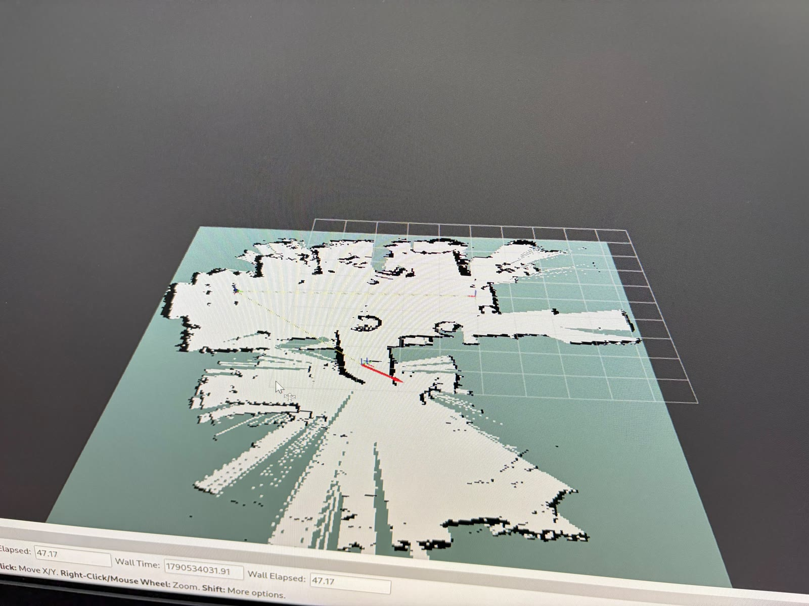
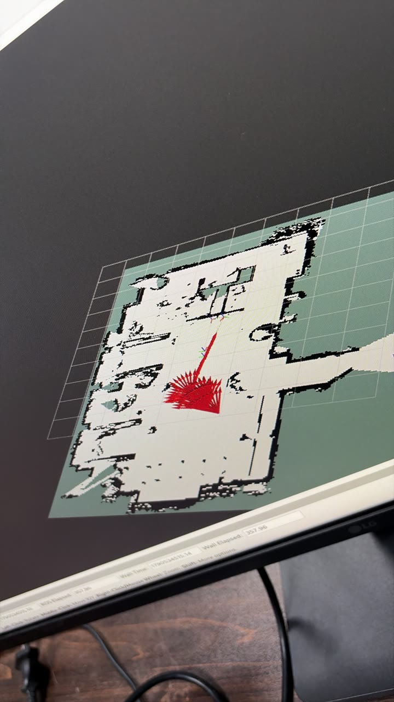
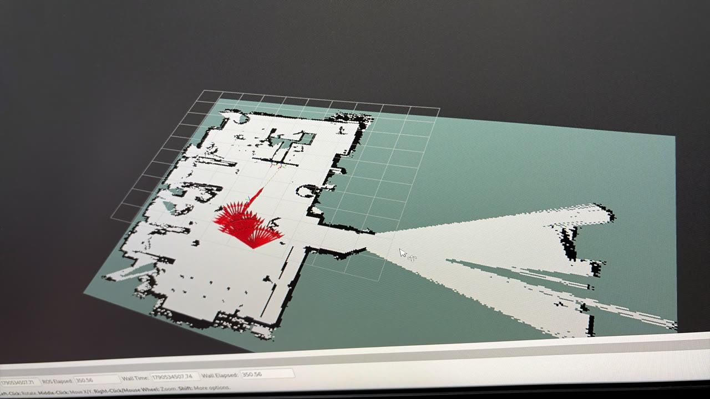
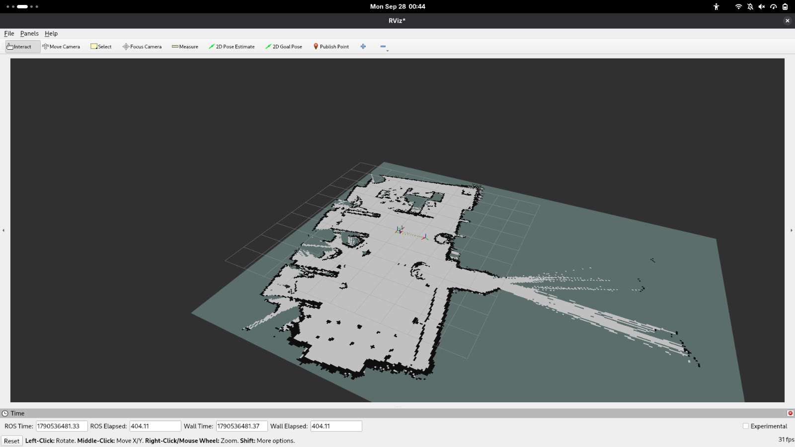
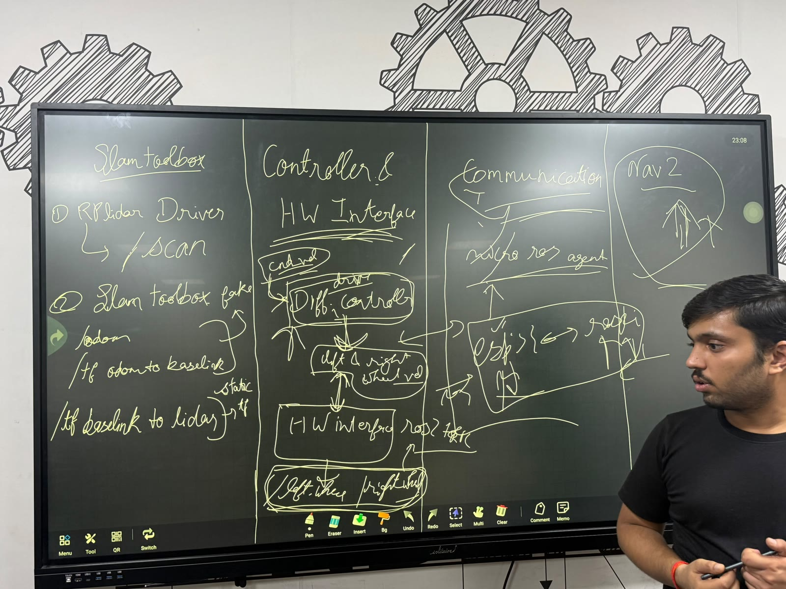
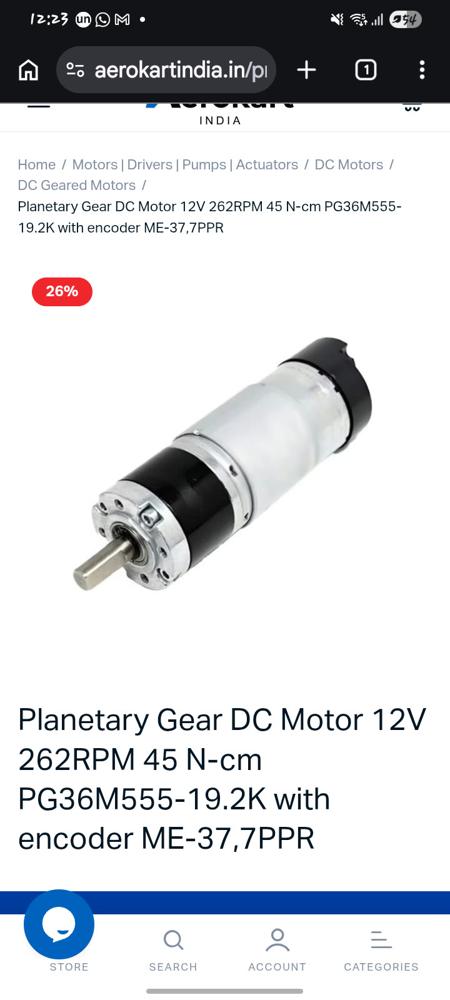

# Testing videos and photos (iteration phase)

Recordings of the tests done while building the robot (23–28 Sep 2026), each with what was tested, the setup and the
outcome. Dates, setups and outcomes come from the team's [project log](../project-log.md). Files are in [`media/`](media/).

## Recorded tests

| # | Date | Media | What was tested | Setup | Outcome / observation |
|---|---|---|---|---|---|
| 1 | 25 Sep | [video](media/2026-09-25_motor-test-rig.mp4) (5 s) | A motor and wheel running on the bench | Motor with encoder, Cytron driver, ESP32 | Motor runs. Before this, motor running had been verified on only one motor (24 Sep) |
| 2 | 25 Sep | [video](media/2026-09-25_pid-velocity-plots.mp4) (24 s) | Wheel velocity PID with encoder feedback | ESP32 firmware, speed targets from the serial monitor, velocity plotted live | Motors follow any commanded speed and recover under manual load. Remaining: tuning the motor deadband under load |
| 3 | 26 Sep | [video](media/2026-09-26_slam-mapping-rviz.mp4) (48 s) | SLAM mapping on the real robot | RPLIDAR A1 + SLAM Toolbox with wheel odometry, RViz | Mapping works on the bot, reached at 04:36 after an all-night integration session ("SLAM bot" challenge completed) |
| 4 | 28 Sep |  | SLAM map | SLAM Toolbox, RViz | TODO (team) |
| 5 | 28 Sep |   | Map with the robot's pose arrows | RViz, pose arrows shown in red | TODO (team) |
| 6 | 28 Sep, 00:11 | [video](media/2026-09-28_driving-tuned-pid.mp4) (24 s) | Driving the assembled robot after PID tuning | Full robot, teleop | Bot drives smoothly: "PID at its peak, no filters" |
| 7 | 28 Sep, 00:47 |  | Map built during the Nav2 bring-up | Nav2 + SLAM, RViz | Map with **no odometry drift**. Mentors' feedback: mapping already worked; Nav2's job is navigation |
| 8 | 28 Sep, 00:49 | [video](media/2026-09-28_nav2-autonomous-navigation.mp4) (6 min) | Nav2 navigation in RViz | Nav2 on the robot, viewed in RViz | Autonomous navigation working; declared complete at 02:32 ("autonomous navigation" challenge completed) |

## Tests without a recording

| Date | What was tested | Outcome (from the log) |
|---|---|---|
| 24 Sep | micro-ROS basic communication Pi ⇄ ESP32 | Set up on both sides; basic communication works |
| 24 Sep | Downstream path Nav2 → Pi → ESP32 with hard-coded values | Ready and tested; upstream (encoder) path pending |
| 24 Sep | LiDAR scans in SLAM Toolbox with fake odometry and static TFs | Scan data coming through correctly |
| 24 Sep | Encoder calibration | Done for one motor first; values differ between motors, so each motor was calibrated; both encoders working |
| 25 Sep | micro-ROS topics with dummy wheel data | Topic names and message formats fixed ([topics doc](https://docs.google.com/document/d/1CKC5PaiLtuVq5qNwfhTToIpuMQxy-mmduqVFJ-J3ZQc/edit?usp=sharing)) |
| 25 Sep | Diff drive code on the Pi | Topics publishing; wheel-state subscription working |
| 25 Sep, 20:57 | First integrated drive | **Bot drives** |
| 26 Sep | TF tree snapshots | `odom → base_link` at 50 Hz, `base_link → laser`, then `map → odom` from SLAM (`../iteration-phase/frames_2026-09-26_*.pdf`) |

## Other media

| File | What |
|---|---|
|  | Whiteboard architecture from the 23 Sep kickoff: SLAM Toolbox (RPLIDAR driver → `/scan`, fake `/odom`, TFs), Controller & HW interface (`cmd_vel` → diff controller → left/right wheel velocity → HW interface), Communication (micro-ROS agent, ESP32 ⇄ Pi), Nav2 |
|  | Motor product page: planetary gear DC motor 12 V, 262 RPM, 45 N·cm, PG36M555-19.2K with encoder ME-37, 7 PPR |

To add a test: put the file in `media/` as `YYYY-MM-DD_short-description.ext` (compress videos to H.264 first) and add a row.
